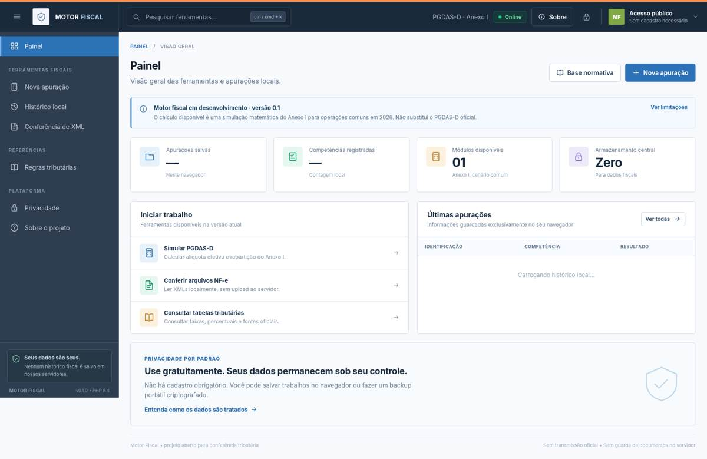
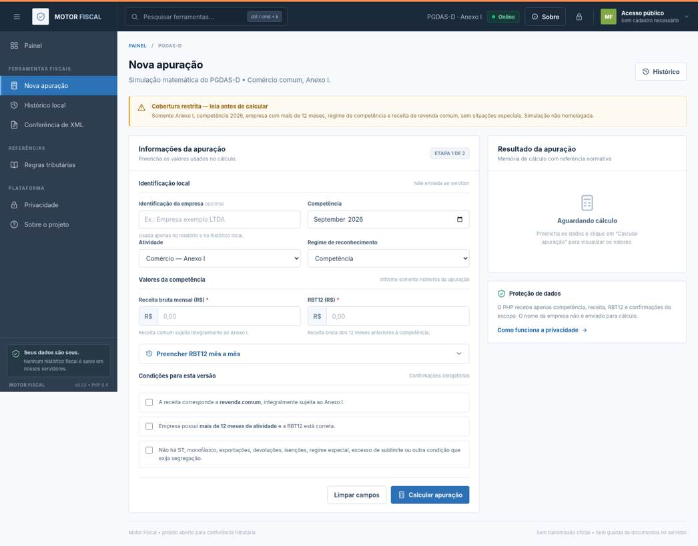

# Northfield — Plataforma fiscal open source · v0.1.0

**Plataforma web open source para contadores**, com interface inspirada no padrão visual enviado do Away CMS: barra superior escura, menu lateral, tabelas e formulários compactos. Identidade própria **Northfield**.

**AVISO:** Esta versão é um MVP funcional de **simulação matemática** do PGDAS-D, Anexo I, exclusivamente para operações comuns do comércio na competência de 2026. Não é uma declaração oficial; não transmite PGDAS-D e não gera DAS. Resultados e repartições **não foram homologados** contra o portal oficial. Para uso profissional, confira com o PGDAS-D da Receita Federal.

## O que funciona

- Painel com métricas de registros locais e atalhos.
- Formulário completo de simulação Anexo I para cenário delimitado de 2026.
- RBT12 informada ou somada a partir dos 12 meses anteriores à competência.
- Seleção de faixa, alíquota nominal, parcela a deduzir, alíquota efetiva e total matemático.
- Repartição **indicativa** em IRPJ, CSLL, Cofins, PIS, CPP e ICMS; diferença de arredondamento explicitada.
- Memória de cálculo com versão das regras, fontes oficiais e limitações.
- Histórico local opt-in com IndexedDB, sem banco de dados no servidor.
- Backups portáteis criptografados (AES-GCM + PBKDF2, 250 mil iterações, senha >= 10 caracteres) usando Web Crypto API no próprio navegador.
- Importação e inspeção local de até 30 XMLs NF-e por lote, 2 MB por arquivo, indicando presença de protocolo de autorização. Não soma XML automaticamente como receita tributável.
- Tabela do Anexo I e links normativos oficiais.
- Busca nos menus, versão responsiva, relatório para impressão, páginas de segurança e privacidade.
- API PHP com JSON, limites de payload e validação estrita, sem persistência de dados de cálculo.

## Rodar no Windows com Laragon ou PHP 8.4

1. Extraia a pasta `northfield` para uma pasta de projetos no seu computador (exemplo: `C:\laragon\www\northfield`).
2. Abra o Terminal (PowerShell) nessa pasta (a pasta **raiz** que contém `app`, `public` e `fiscal-rules`).
3. Confirme `php -v` (8.4 ou superior na série 8.4); o projeto não exige Composer nem MySQL/PostgreSQL para rodar.
4. Execute:

   ```powershell
   php -S 127.0.0.1:8000 -t public public/router.php
   ```

5. Abra **http://127.0.0.1:8000** no Chrome, Edge ou Firefox atualizado.
6. Em **Nova apuração**, informe, para teste, `2026-09`, receita `10.000,00`, RBT12 `360.000,00` e confirme as três condições. O **resultado matemático esperado** é **R$ 565,00**, ainda sujeito a validação pelo sistema oficial.
7. Execute os testes em outro terminal: `php tests/run.php`.

Se o Laragon abrir `http://northfield.test/` apontando para a raiz do repositório, **não use**: crie o virtual host com document root na pasta **`public/`**, para impedir exposição de código PHP interno e tabelas de regras.

## Publicar em VPS

- Requer PHP 8.4, Nginx, PHP-FPM e HTTPS. Não precisa de MySQL nem PostgreSQL no MVP.
- `root` do Nginx deve apontar exclusivamente para `/var/www/northfield/public`.
- Proteja `app/`, `fiscal-rules/`, `docs/` e qualquer configuração fora do public.
- Use configuração de referência em [`deployment/nginx.conf`](deployment/nginx.conf) e adapte o domínio, certificados TLS, caminho PHP-FPM e limites de acesso à sua infraestrutura.
- Nunca exponha a versão de desenvolvimento via `php -S` na internet pública.
- Adote minimização/rotação de logs, sem capturar payloads fiscais.
- Monitore memória, CPU, taxa de erros e testes de carga antes de abrir ao público.
- Ative backups **do código e das regras** no servidor; arquivos de contribuintes permanecem com seus respectivos titulares.
- O mecanismo Web Crypto API precisa de contexto seguro: **HTTPS** ou **localhost**.

## Arquitetura

```text
app/Core/BigNatural.php        aritmética decimal exata sem float
app/Core/Money.php             conversão textual para centavos
app/Fiscal/PgdasCalculator.php motor matemático Anexo I
app/Http/Http.php              respostas JSON
fiscal-rules/2026/             regras e fontes documentadas
public/index.php               roteamento e API
public/assets/css/app.css     interface customizada
public/assets/js/             UI, IndexedDB, criptografia e XML
resources/views/              templates PHP de cada tela
tests/run.php                  testes locais
```

### Decisões de segurança

- Não há login, banco central ou persistência de XML.
- A API recebe **somente** competência, anexo, regime, receita, RBT12 e confirmações de escopo. Nome da empresa não é enviado.
- Os valores enviados via HTTPS são processados na memória do PHP e retornados sem gravação de documentos ou apurações.
- Uma execução ainda pode produzir registros técnicos de acesso no Nginx/infraestrutura (IP etc.). O projeto exige política de retenção mínima na VPS.
- **IndexedDB não é criptografado por padrão**. Use backup criptografado, dispositivo de confiança e limpeza local em computadores compartilhados.
- Arquivos de backup importados devem ser recalculados; dados históricos não são aceitos como cálculos vigentes automaticamente.
- HTTP JSON no máximo 8 KB; roteamento bloqueia origens inesperadas e a VPS deve aplicar rate limiting real.

## Escopo de regras e ressalvas

- Ano exclusivamente **2026**, Anexo **I**, regime de **competência**, empresa com **mais de 12 meses** de atividade e receitas inteiramente comuns, **sem** ICMS-ST, monofásico, devoluções, exportação, isenção, regimes especiais, receitas mistas ou excedentes de limites/sublimites.
- O software exige confirmações expressas e bloqueia RBT12 acima de **R$ 3,6 milhões**. A configuração não substitui análise do acumulado no ano para fins de sublimite e da legislação específica.
- **Alíquota efetiva:** `((RBT12 × aliquota_nominal) - deducao) / RBT12`. Cálculo exato por inteiros decimais, com half-up no valor matemático final. A política de arredondamento **não foi validada** contra todas as regras do PGDAS-D oficial.
- A repartição é **indicativa**, podendo gerar diferença de centavos. Não altera silenciosamente valores para forçar fechamento.
- Importação de XML NF-e não considera cancelamentos em eventos separados, devoluções e demais fatos tributários; `vNF` não determina automaticamente receita bruta tributável.
- **Não utilizar para apuração ou transmissão oficial sem validação independente**.

Fontes legislativas documentadas no JSON:
- [LC nº 123/2006 — Planalto](https://www.planalto.gov.br/ccivil_03/leis/lcp/lcp123.htm)
- [Resolução CGSN nº 140/2018 — Receita Federal](https://normas.receita.fazenda.gov.br/sijut2consulta/link.action?idAto=92278)
- [Sublimite de ICMS/ISS de 2026 — CGSN](https://www8.receita.fazenda.gov.br/simplesnacional/noticias/NoticiaCompleta.aspx?id=94c10cc2-7eb5-4ef0-bfb2-5479e72caff8)

## Próximos módulos

Validação homologatória de cálculos por competência, início de atividade, regime de caixa, ICMS-ST, monofásico, devoluções, demais anexos, Fator R, importação estruturada NFS-e, auditoria e integração oficial futura (apenas com autorização e credenciamento).

## Licença

MIT. Consulte [`LICENSE`](LICENSE). É uma iniciativa independente, não afiliada à Receita Federal, Serpro, CGSN ou Away CMS.

## Prévias da interface

- 
- 

As imagens representam o estado inicial das telas e foram renderizadas a partir dos templates PHP e do CSS do projeto.

## Repositório

Projeto Northfield: https://github.com/robsonmktsouza-stack/Northfield.
